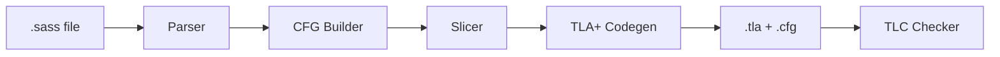

# tlagen: SASS to TLA+ Pipeline

`tlagen` is a toolchain for automatically lifting NVIDIA SASS (Shader Assembly) GPU instructions into formal TLA+ specifications. It allows you to model concurrent GPU kernels at the instruction level and verify them using the [TLC model checker](https://lamport.azurewebsites.net/tla/tools.html).

The project provides a complete pipeline from raw assembly to verifiable formal models, supporting complex control flow, predication, and multi-warp execution.

---

## The Pipeline



1.  **Parse:** Ingests cleaned `nvdisasm` output into a structured AST.
2.  **Analyze:** Builds a Control Flow Graph (CFG) and performs dataflow analysis (reaching definitions).
3.  **Slice:** (Optional) Removes instructions unrelated to your property of interest (e.g., slicing on `WARPSYNC`) to minimize the TLA+ state space.
4.  **Emit:** Lifts the sliced CFG into a `TLASassProcess` and generates the TLA+ module.

---

## Core Components

### 1. SASS Parser (`src/sass/parser.py`)
A robust parser for NVIDIA SASS. It handles:
- Register operands (GPRs, Uniform, Predicates, Special Registers).
- Memory operands, constant banks, and descriptors.
- Instruction predication (`@P0`, `@!UP1`).
- Labels and function boundaries.

### 2. CFG Builder & Slicer (`src/sass/cfg.py`, `src/sass/slicer.py`)
Constructs a Basic Block-based CFG from the parsed instructions.
- Handles divergent control flow (`BRA`, `BRX`, `EXIT`, `RET`).
- **Slicing:** Uses backward data-dependency and control-dependency walking to keep only the instructions that affect a specific target set. This is critical for making GPU kernels small enough for model checking.

### 3. TLA+ Codegen (`src/tla_codegen.py`)
Lifts the SASS CFG into the TLA+ modeling layer.
- **`SassCFGCodegen`**: Automatically maps SASS mnemonics to TLA+ expressions.
- Supports a wide range of opcodes: `IMAD`, `IADD3`, `LOP3`, `SHF`, `SEL`, `LDG/STG`, `ISETP`, `WARPSYNC`, and more.
- Automatically discovers register usage to declare TLA+ variables.

### 4. TLA+ Framework (`src/tla_module.py`, `src/tla_thread.py`)
A general-purpose framework for modeling concurrent processes in TLA+.
- **`TLAModule`**: AST for TLA+ expressions and module generation.
- **`TLAThread`**: Abstraction for threads with Program Counters (PC) and local state.

---

## Usage Example

### Lifting a SASS Kernel to TLA+

```python
import sys
from sass.parser import parse_file
from sass.cfg import build_cfgs, slice_cfg
from tla_codegen import SassCFGCodegen

# 1. Parse the SASS file
prog = parse_file("kernel.sass")
cfgs = build_cfgs(prog)

# 2. Slice on a specific instruction (e.g., any BAR or SYNC)
# This keeps only the logic affecting these instructions.
sliced = slice_cfg(cfgs["my_kernel_name"], pattern="BAR|SYNC")

# 3. Generate the TLA+ Process
codegen = SassCFGCodegen()
proc = codegen.generate(sliced, name="MyModel", n_warps=2)

# 4. Output the TLA+ specification and TLC config
with open("MyModel.tla", "w") as f:
    f.write(str(proc))

with open("MyModel.cfg", "w") as f:
    f.write(proc.getConfiguration())
```

---

## Supported SASS Features

- **Arithmetic:** `IADD3`, `IMAD`, `IMAD.WIDE`, `IABS`, `IMNMX`, `LEA.HI`.
- **Logical:** `LOP3.LUT`, `PLOP3.LUT`, `SEL`.
- **Shift:** `SHF.R.U32.HI`, `SHF.R.S32.HI`.
- **Memory:** `LDG.E`, `LDS`, `LDC`, `STG`, `STS` (including 64/128-bit variants).
- **Predication:** `ISETP` (all variants), `P2R`, and instruction-level guards.
- **Concurrency:** `WARPSYNC`, `BAR.SYNC`, `MEMBAR`, `ELECT`, `BSSY/BSYNC`.

---

## Development

- **Python 3.12+** required.
- **No external Python dependencies** (pure stdlib).
- Requires `tla2tools.jar` (included) or the TLA+ Toolbox to run the generated models.

### Project Structure
- `src/sass/`: SASS parsing, CFG, and slicing logic.
- `src/tla_module.py`: Core TLA+ expression AST.
- `src/tla_thread.py`: Process/Thread modeling.
- `src/tla_sass.py`: SASS-specific modeling extensions.
- `src/tla_codegen.py`: The bridge between SASS CFGs and TLA+ models.
- `regalloc-dataset/`: SASS samples for testing and validation.
