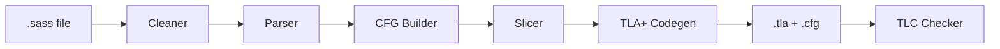

# tlagen: SASS to TLA+ Pipeline

`tlagen` lifts NVIDIA SASS (Shader Assembly) GPU instructions into formal [TLA+](https://lamport.azurewebsites.net/tla/tla.html) specifications for model checking with [TLC](https://lamport.azurewebsites.net/tla/tools.html). It targets verification of concurrent GPU kernel behavior — specifically dynamic register allocation semantics — at the instruction level.

Supports Hopper (sm_90a) and Blackwell (sm_100a) architectures.

---

## Pipeline


```mermaid
graph LR
    SASS[.sass file] --> Cleaner
    Cleaner --> Parser
    Parser --> CFG[CFG Builder]
    CFG --> Slicer
    Slicer --> Codegen[TLA+ Codegen]
    Codegen --> TLA[.tla + .cfg]
    TLA --> TLC[TLC Checker]
```

1. **Clean:** Strips raw `nvdisasm` output down to bare instructions (`src/sass/cleaner.py`).
2. **Parse:** pyparsing PEG grammar ingests cleaned SASS into a structured AST (`src/sass/parser.py`).
3. **Analyze:** Builds a basic-block CFG with reaching-definition dataflow analysis (`src/sass/cfg.py`).
4. **Slice:** Backward data/control-dependency walk removes instructions unrelated to the verification target (e.g., `WARPSYNC`), minimizing the TLA+ state space (`src/sass/slicer.py`).
5. **Emit:** Lifts the sliced CFG into a `TLASassProcess` and generates the TLA+ module + TLC config (`src/tla_codegen.py`).

---

## Quick Start

### CLI

```bash
cd src

# List available kernels in a SASS file
python sass2tla.py ../examples/fp_ops/GroupedMixedInputGemmKernel.sm_100a.sass

# Generate TLA+ spec for a specific kernel
python sass2tla.py ../examples/fp_ops/GroupedMixedInputGemmKernel.sm_100a.sass \
  --kernel kernel_cutlass_kernel___main__GroupedMixedInputGemmKernel_... \
  --module Test
```

This produces `Test.tla`, `Test.cfg`, and optionally `Test.dot` (with `--export_dot`).

#### CLI Options

| Flag | Description | Default |
|------|-------------|---------|
| `sassfile` | Input SASS file (required) | — |
| `--kernel` | Kernel name to extract (lists available if omitted) | — |
| `--module` | Output TLA+ module name | derived from kernel |
| `--instr_match` | Regex pattern for slice target | `WARPSYNC` |
| `--keep_control_edges` | Preserve control dependencies when slicing | off |
| `--export_dot` | Export CFG as Graphviz DOT | off |
| `--gridDim X Y Z` | Grid dimensions for thread-block IDs | `1 1 1` |
| `--blockDim X Y Z` | Block dimensions for thread IDs | `1 1 1` |

### Python API

```python
from sass.parser import parse_file
from sass.cfg import build_cfgs
from sass.slicer import slice_cfg
from tla_codegen import SassCFGCodegen

prog = parse_file("kernel.sass")
cfgs = build_cfgs(prog)
sliced = slice_cfg(cfgs["my_kernel"], pattern="WARPSYNC")

codegen = SassCFGCodegen()
proc = codegen.generate(sliced, name="MyModel", n_warps=2)

with open("MyModel.tla", "w") as f:
    f.write(str(proc))
with open("MyModel.cfg", "w") as f:
    f.write(proc.getConfiguration())
```

---

## Supported SASS Instructions

~65 mnemonic variants are modeled with full TLA+ semantics:

| Category | Instructions |
|----------|-------------|
| **Data movement** | `MOV`, `UMOV`, `S2R`, `S2UR`, `CS2R` |
| **Integer arithmetic** | `IADD3`/`UIADD3`, `IMAD` (MOV/IADD/SHL/HI variants), `UIMAD`, `IABS`, `IMNMX` |
| **Address computation** | `LEA`, `LEA.HI`/`ULEA.HI` (incl. `.SX32`) |
| **Shift** | `SHF.R.U32.HI`, `SHF.R.S32.HI`, `SHF.L.U32` (+ uniform variants) |
| **Logical** | `LOP3.LUT`/`ULOP3.LUT`, `PLOP3.LUT`, `SEL`/`USEL` |
| **Predicates** | `ISETP`/`UISETP` (LT/GT/GE/NE/EQ/LE, AND/OR), `P2R` |
| **Constant loads** | `LDC`/`ULDC`/`LDCU` (32- and 64-bit) |
| **Synchronization** | `WARPSYNC`, `SYNCS.PHASECHK`, `USETMAXREG` (TRY_ALLOC/DEALLOC) |
| **Float (data-dep only)** | `I2F`, `MUFU.RCP`, `F2I` |

Unsupported instructions are logged as `UNSUPPORTED` and skipped.

---

## Core Components

### SASS Parser (`src/sass/parser.py`)
pyparsing-based PEG grammar (spec in `docs/grammar.md`). Handles all operand types: GPRs, uniform registers (UR0–UR79 on Blackwell), predicates, special registers (mixed-case like `SR_CgaCtaId`), constant banks, descriptors, memory addresses, and branch targets.

### CFG Builder (`src/sass/cfg.py`)
Constructs basic-block CFGs per kernel. Handles `BRA`, `BRX` (indirect), `CALL`/`RET`, `EXIT`, `BSSY`/`BSYNC`, and predicated control flow.

### Slicer (`src/sass/slicer.py`)
Backward dependency slicing on data and control edges. Critical for reducing real kernels (thousands of instructions) to a tractable TLA+ state space.

### TLA+ Framework (`src/tla_module.py`, `src/tla_thread.py`, `src/tla_sass.py`)
General-purpose TLA+ AST with expression types, module generation, and a concurrent process abstraction. `TLASassProcess` / `TLASassThread` extend this with GPU-specific register sets and warp semantics.

### TLA+ Codegen (`src/tla_codegen.py`)
Handler-table-driven translation from SASS CFG to TLA+ actions. Automatically discovers register usage and declares TLA+ variables.

### Trace Viewer (`src/trace_viewer.py`)
Parses NVBit register traces to inspect per-instruction register state. Used for deriving and validating instruction semantics.

---

## Project Structure

```
src/
  sass2tla.py            # CLI entry point
  sass/
    parser.py            # pyparsing SASS parser
    cleaner.py           # nvdisasm output cleaner
    cfg.py               # CFG builder + dataflow analysis
    slicer.py            # backward dependency slicer
    sass_insns.h         # C reference semantics (NVBit)
    test_parser.py       # parser tests
    test_cfg_slicer.py   # CFG/slicer tests
  tla_module.py          # TLA+ expression AST
  tla_thread.py          # generic thread/process model
  tla_sass.py            # SASS-specific TLA+ extensions
  tla_codegen.py         # SASS CFG → TLA+ translation
  trace_viewer.py        # NVBit trace parser
  constants.py           # register allocation constants
examples/                # real GPU kernels (Hopper sm_90a, Blackwell sm_100a)
  fp_ops/                # float-heavy attention/GEMM kernels
docs/
  grammar.md             # SASS parser grammar spec
  missing_sass.txt       # unsupported instruction catalog
  instructions.txt       # instruction semantics notes
  traces.txt             # NVBit trace samples
```

---

## Development

- **Python 3.13+** required.
- **Dependencies:** `pyparsing` (managed via Poetry).
- `tla2tools.jar` included for running generated models.

```bash
# Install
poetry install

# Run parser tests
cd src && python -m sass.test_parser

# Run CFG/slicer tests
cd src && python -m sass.test_cfg_slicer
```

---

## Credits

- [Prof. Sreepathi Pai](https://cs.rochester.edu/~sree/) for his [NVIDIA SASS parser](https://github.com/pyxis-roc/gpucode-analyzer/tree/main)
- Claude for helping implement the numerous SASS instruction semantics
