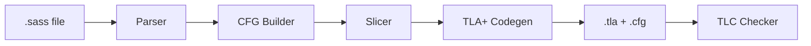

# tlagen: SASS to TLA+ Pipeline

Author: [David Yue](https://davidyue.me) \<david.yue@utah.edu\>, [Leo Sciortino](https://leosciortino.github.io/) \<leo.sciortino@utah.edu\>

`tlagen` lifts NVIDIA SASS (Shader Assembly) GPU instructions into formal [TLA+](https://lamport.azurewebsites.net/tla/tla.html) specifications for model checking with [TLC](https://lamport.azurewebsites.net/tla/tools.html). It targets verification of concurrent GPU kernel behavior — specifically dynamic register allocation semantics — at the instruction level.

Supports Hopper (sm_90a) and Blackwell (sm_100a) architectures.

---

## Pipeline


```mermaid
graph LR
    SASS[.sass file] --> Parser
    Parser --> CFG[CFG Builder]
    CFG --> Slicer
    Slicer --> Codegen[TLA+ Codegen]
    Codegen --> TLA[.tla + .cfg]
    TLA --> TLC[TLC Checker]
```

1. **Parse:** Prof. Sreepathi Pai's [`gpucode-analyzer`](https://github.com/pyxis-roc/gpucode-analyzer) (vendored under `src/sass/gpucodeanalyzer/`) ingests cuobjdump-style SASS into a typed AST.
2. **Build CFG:** `gpucode-analyzer` builds a per-kernel basic-block CFG with reaching-definition dataflow analysis.
3. **Slice:** Backward data/control-dependency walk removes instructions unrelated to the verification target (default: `WARPSYNC|USETMAXREG`), minimizing the TLA+ state space.
4. **Emit:** Lifts the sliced CFG into a `TLASassProcess` and generates the TLA+ module + TLC config (`src/tla_codegen.py`).
5. **Check:** TLC enumerates the reachable state space and reports any invariant or temporal-property violation.

---

## Quick Start

### CLI

```bash
cd src

# List available kernels in a SASS file (omit --kernel to enumerate)
python sass2tla.py ../examples/regalloc-dataset/regalloc/reduction_warp_specialized.sass \
  --regs_per_thread 200

# Generate TLA+ spec for a specific kernel
python sass2tla.py ../examples/regalloc-dataset/regalloc/reduction_warp_specialized.sass \
  --regs_per_thread 200 \
  --kernel _Z16reduction_kernelv \
  --module Test
```

This produces `Test.tla`, `Test.cfg`, and optionally `Test.dot` (with `--export_dot`).

To run the model checker on the generated spec:

```bash
java -jar ../tla2tools_i64.jar -config Test.cfg Test.tla
```

The bundled `tla2tools_i64.jar` is a 64-bit-integer build of TLC; the unmodified jar overflows on GPU address arithmetic.

#### CLI Options

| Flag | Description | Default |
|------|-------------|---------|
| `sassfile` | Input SASS file (required) | — |
| `--regs_per_thread` | Per-thread register ceiling (required) | — |
| `--kernel` | Kernel name to extract (lists available if omitted) | — |
| `--module` | Output TLA+ module name | derived from kernel |
| `--instr_match` | Regex pattern selecting slice targets | `WARPSYNC\|USETMAXREG` |
| `--keep_control_edges` | Preserve control dependencies when slicing | off |
| `--export_dot` | Export sliced CFG as Graphviz DOT | off |
| `--grid_dim X Y Z` | Grid dimensions for thread-block IDs | `1 1 1` |
| `--block_dim X Y Z` | Block dimensions for thread IDs | `1 1 1` |

### Batch runner

`run_examples.sh` walks every `.sass` file in `examples/regalloc-dataset/regalloc/`, runs the codegen for each kernel, and invokes TLC with a configurable timeout (`TLC_TIMEOUT`, default 120s). Results are classified as pass / property-violation / overflow / timeout / error.

### Python API

```python
from tla_codegen import SassCFGCodegen, parse_sass_file, slice_cfg

cfgs = parse_sass_file("kernel.sass")
sliced = slice_cfg(cfgs["my_kernel"], pattern="WARPSYNC|USETMAXREG")

codegen = SassCFGCodegen()
proc = codegen.generate(sliced, name="MyModel", reg_per_thread=200)

with open("MyModel.tla", "w") as f:
    f.write(str(proc))
with open("MyModel.cfg", "w") as f:
    f.write(proc.getConfiguration())
```

---

## Supported SASS Instructions

~65 mnemonic variants are modeled with full TLA+ semantics:

| Category | Instructions |
|----------|-------------|
| **Data movement** | `MOV`, `UMOV`, `S2R`, `S2UR`, `CS2R` |
| **Integer arithmetic** | `IADD3`/`UIADD3`, `IMAD` (MOV/IADD/SHL/HI variants), `UIMAD`, `IABS`, `IMNMX` |
| **Address computation** | `LEA`, `LEA.HI`/`ULEA.HI` (incl. `.SX32`) |
| **Shift** | `SHF.R.U32.HI`, `SHF.R.S32.HI`, `SHF.L.U32` (+ uniform variants) |
| **Logical** | `LOP3.LUT`/`ULOP3.LUT`, `PLOP3.LUT`, `SEL`/`USEL` |
| **Predicates** | `ISETP`/`UISETP` (LT/GT/GE/NE/EQ/LE, AND/OR), `P2R` |
| **Constant loads** | `LDC`/`ULDC`/`LDCU` (32- and 64-bit) |
| **Synchronization** | `WARPSYNC`, `SYNCS.PHASECHK`, `USETMAXREG` (TRY_ALLOC/DEALLOC) |
| **Float (data-dep only)** | `I2F`, `MUFU.RCP`, `F2I` |

Unsupported instructions are logged as `UNSUPPORTED` and skipped.

---

## Verification Properties

`sass2tla.py` synthesises the following invariants and temporal properties on top of every generated module:

- `NoErrorState` — no thread is ever in the distinguished `error` PC.
- `RegReqCheck` — every `numRegThread[t]` stays within `[24, 256]` and is divisible by 8.
- `RegInRange_<pc>` — at any PC that touches register `Rk`, the per-thread ceiling is at least `k+1`.
- `SetmaxnregUniform_<i>` — within a warp group, a `USETMAXREG` PC is all-or-nothing.
- `IncLTCurr_<pc>` / `DecGTCurr_<pc>` — alloc/dealloc operations are only enabled when the new ceiling is consistent with the current one.
- `UsetmaxregProgress_<i>` — leads-to liveness: every thread sitting at an allocation PC must eventually leave it (under weak fairness).

---

## Core Components

### Parser, CFG Builder, Slicer (`src/sass/gpucodeanalyzer/`)
Vendored copy of [`gpucode-analyzer`](https://github.com/pyxis-roc/gpucode-analyzer). Handles all SASS operand types (GPRs, uniform registers UR0–UR79, predicates, special registers, constant banks, descriptors, memory addresses, branch targets), constructs basic-block CFGs per kernel, and performs backward data/control-dependency slicing. Critical for reducing real kernels (thousands of instructions) to a tractable TLA+ state space.

### TLA+ Framework (`src/tla_module.py`, `src/tla_thread.py`, `src/tla_sass.py`)
General-purpose TLA+ AST with expression types, module generation, and a concurrent process abstraction. `TLASassProcess` / `TLASassThread` extend this with GPU-specific register sets, warp groups, the per-CTA register pool, and `USETMAXREG` semantics.

### TLA+ Codegen (`src/tla_codegen.py`)
Handler-table-driven translation from a sliced SASS CFG to TLA+ actions. Automatically discovers register usage, declares the corresponding TLA+ variables, and emits one guarded action per SASS instruction. Empty/sliced-away terminator blocks are closed off with stuttering self-loops to avoid spurious deadlocks.

### Trace Explorer (`src/trace_explorer.py`)
Parses NVBit register traces to inspect per-instruction register state. Used for deriving and validating instruction semantics from observed execution.

---

## Project Structure

```
src/
  sass2tla.py            # CLI entry point
  sass/
    gpucodeanalyzer/     # vendored gpucode-analyzer (parser + CFG + slicer)
    gpucode_adapter.py   # thin convenience wrapper around the above
    sass_insns.h         # C reference semantics (NVBit)
  tla_module.py          # TLA+ expression AST
  tla_thread.py          # generic thread/process model
  tla_sass.py            # SASS-specific TLA+ extensions
  tla_codegen.py         # SASS CFG -> TLA+ translation
  trace_explorer.py      # NVBit trace parser/explorer
  constants.py           # register allocation constants
  examples/              # small Python examples driving the TLA+ API directly
examples/                # real GPU kernels (Hopper sm_90a, Blackwell sm_100a)
  fp_ops/                # float-heavy attention/GEMM kernels
  regalloc-dataset/      # warp-specialized kernels exercising USETMAXREG
docs/
  grammar.md             # SASS parser grammar spec
  missing_sass.txt       # unsupported instruction catalog
  instructions.txt       # instruction semantics notes
  ptx_semantics.txt      # PTX-level reference notes
  traces.txt             # NVBit trace samples
  slides.typ             # final-presentation slides (typst)
report/
  report.typ             # final project report (typst)
run_examples.sh          # batch driver: codegen + TLC over the regalloc dataset
tla2tools_i64.jar        # 64-bit-integer build of TLC
```

---

## Development

- **Python 3.13+** required.
- **Dependencies:** `pyparsing` (managed via Poetry).
- `tla2tools_i64.jar` included for running generated models with 64-bit integer support.

```bash
# Install
poetry install

# Run the batch driver over the regalloc dataset
./run_examples.sh
```

---

## Credits

- [Prof. Sreepathi Pai](https://cs.rochester.edu/~sree/) for advising and for his [`gpucode-analyzer`](https://github.com/pyxis-roc/gpucode-analyzer) (parser, CFG builder, slicer) and NVBit trace tooling.
- Claude for helping implement the numerous SASS instruction semantics.
